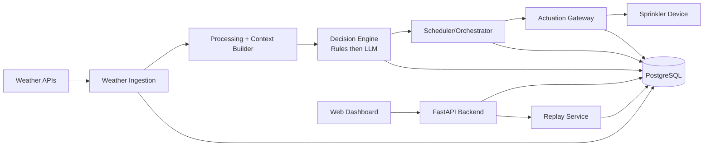

# Architecture Specification

## 1. Purpose

Define component boundaries and data flow for AISprinkler, which adjusts daily irrigation duration using weather context while keeping deterministic safety controls.

## 2. v1 Scope Boundary

Included:

- Single irrigation device
- Daily baseline schedule persistence
- AI recommendation for next-run adjustment using recent observed weather and forecast context
- Deterministic rules and confidence gate
- Trigger and execution contract
- Full traceability

Excluded:

- Multiple devices
- Zone-level control
- Online reinforcement learning
- Dynamic soil sensor fusion outside basic optional field support

## 2.1 Current Alignment Snapshot (April 2026)

This document distinguishes:

- Target architecture: production-grade on-prem design.
- Current implementation: partially complete runtime path in this repository.

| Component | Target | Current status |
|---|---|---|
| Scheduler/orchestration | Daily + event-triggered orchestration with durable retries | Daily Celery task path is implemented; event-triggered reevaluation and dead-letter handling are not implemented |
| Weather ingestion | Primary/fallback provider adapters with staleness controls | Weather provider selection is runtime-configurable via `WEATHER_PROVIDER`; refresh-capable providers can persist forecast rows through a provider-neutral contract, but automatic provider fallback on runtime failure is not yet implemented |
| AI decision agent | LLM-backed structured recommendation | `LangChainAgentAdapter` is implemented and selectable via `AGENT_MODE`; default mode remains heuristic |
| Rule/safety layer | Deterministic post-LLM safety constraints | Implemented and wired in `RunDailyAdjustmentUseCase` |
| Execution/actuation | Device protocol adapter with idempotent dispatch + proof | `NoOpDeviceAdapter` is active by default; real hardware adapter remains TODO |
| API/dashboard | Monitoring + manual review/override UI and APIs | Schedule APIs are implemented; run/manual-review APIs remain placeholder |
| Replay/audit | Full historical replay with immutable artifacts | Scripted historical replay is implemented (`scripts/adjust_schedule_last30d.py`); full run artifact persistence and replay service/API remain incomplete |

## 2.2 High-Level On-Prem Data Flow

Tradeoff for this repo: keep control path simple on-prem (PostgreSQL + Celery + one configured weather provider at a time) and add heavier event infrastructure only when replay/throughput needs justify it.

## 3. Component Model

### 3.1 Scheduler and Orchestrator

Responsibilities:

- Trigger daily run and optional event-driven reevaluation
- Trigger operational refresh runs and support replay/manual triggers
- Manage run state transitions
- Execute idempotent orchestration steps
- Handle retries, fallback, and escalation

### 3.2 Weather Integration Layer

Responsibilities:

- Pull weather from primary provider
- Fallback to secondary provider on failure or stale data
- Normalize observations and forecasts
- Persist snapshot used for decision
- Refresh future forecast horizon (next 7 days) on each pull for consistent observability

Current implementation note:

- Scheduler DI resolves weather through `WEATHER_PROVIDER` rather than binding API
  or orchestration code to a specific provider.
- `open_meteo` is the default refresh-capable provider; `openweather` and
  `synthetic` remain configurable runtime options.
- Manual forecast refresh (`POST /api/v1/weather/refresh`) uses the configured
  provider only when that provider implements the forecast-refresh contract.
- Provider failures currently fail the run path (with task-level retry) rather
  than switching provider automatically.

### 3.3 AI Decision Agent

Responsibilities:

- Consume baseline schedule + normalized weather + policy context
- Produce structured recommendation with rationale and confidence
- Stay inside deterministic bounds defined in policy
- Avoid example-copy behavior through explicit prompt constraints and output validation/coercion

Implementation: `LangChainAgentAdapter` (`infrastructure/agent/langchain_agent.py`).

Prompt/rules source: `config/SPRINKLER_LLM_RULES.md`.

LLM provider is **runtime-configurable** via the `LLM_PROVIDER` environment variable:

| Provider | Value | Notes |
|---|---|---|
| OpenAI (default) | `openai` | Requires `OPENAI_API_KEY` |
| Anthropic | `anthropic` | Requires `ANTHROPIC_API_KEY` |
| Ollama (local) | `ollama` | No API key; set `OLLAMA_BASE_URL` |

Model name is further overridable via `LLM_MODEL`. See `docs/LANGCHAIN_CONFIG_SPEC.md §9`.

Current implementation note:

- Runtime agent is selected by `AGENT_MODE` (`heuristic` or `langchain`).
- Default is heuristic for safety while rollout hardening continues.

### 3.4 Deterministic Rule Engine

Responsibilities:

- Enforce hard constraints independent of LLM
- Clamp or override recommendation when required
- Record which rules were applied

### 3.5 Execution Adapter

Responsibilities:

- Convert approved schedule into device command schema
- Apply command with timeout/retry contract
- Return execution receipt including proof fields

Current implementation note:

- Runtime dispatch currently uses `NoOpDeviceAdapter`.
- Production actuation adapter remains pending.

### 3.6 Persistence Layer

Responsibilities:

- Store schedules, weather, recommendations, executions, and audit events
- Guarantee immutable decision snapshots and append-only audit log behavior

## 4. High-Level Flow

1. Run is created by scheduler and assigned correlation id.
2. Baseline schedule and weather context are loaded.
3. Agent proposes bounded action: keep, reduce, skip, or increase.
4. Rule engine evaluates hard constraints and finalizes proposal.
5. Confidence gate selects auto-apply or manual-review path.
6. Approved command is sent to execution adapter.
7. Receipt and all trace artifacts are persisted.

Run state names and valid transitions for each step above are defined in
`docs/ORCHESTRATION.md §3` (10 states: queued → collecting_data → reasoning →
rule_check → approval_gate → dispatching → verifying → closed | failed | manual_review).

## 5. Runtime Responsibility Split

- LLM decides recommendation inside policy envelope.
- Rule engine has final authority on safety constraints.
- Confidence gate controls autonomous vs review path.
- Orchestrator controls state, retries, and completion semantics.

## 6. Non-Functional Targets (Design)

- Reproducibility: same inputs and same policy produce same final action.
- Explainability: every run stores rationale, rule set, and applied constraints.
- Resilience: failures degrade to baseline schedule when safe.
- Operability: each run is traceable end to end with one correlation id.

On-prem emphasis:

- Prefer fail-safe behavior over aggressive automation.
- Keep control-path dependencies minimal.
- Treat horizontal scaling as secondary to reliability and auditability.

## 7. Architecture Decisions

- Decision A1: Single-device v1 simplifies orchestration and traceability.
- Decision A2: Deterministic rule layer is mandatory to bound LLM behavior.
- Decision A3: Fallback weather provider is mandatory for run continuity.
- Decision A4: Confidence-gated automation reduces risk while preserving autonomy.
